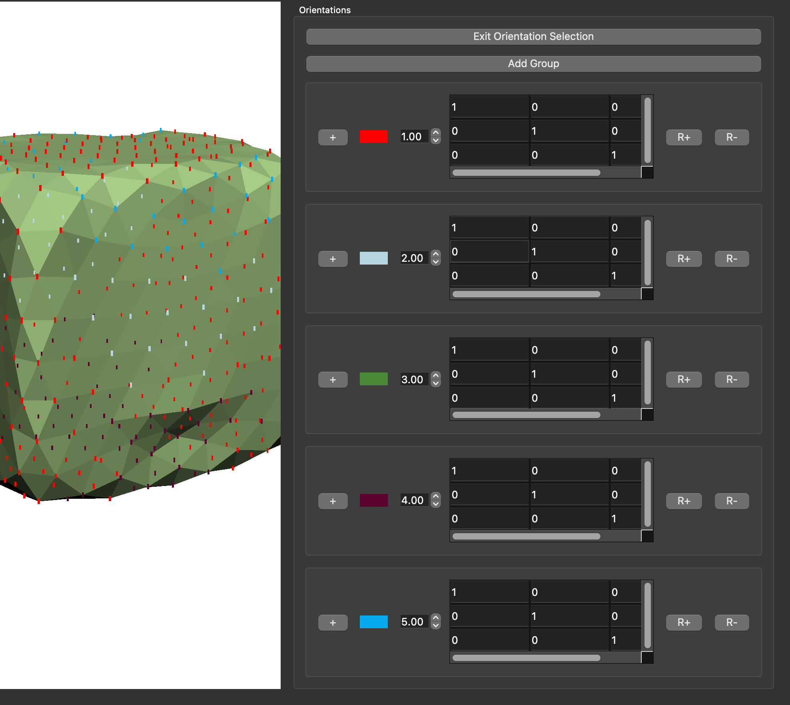

# Cubosity: Interactive Mesh Stylization


Cubosity is an implementation of [Cubic Stylization](https://www.dgp.toronto.edu/projects/cubic-stylization/) (Liu & Jacobson, 2019), created as a final project for the Spring 2023 offering of [CSCI 2240](https://cs2240.graphics/) by Zack Amiton & [Stewart Morris](https://github.com/stew2003).

## **Installation & Setup**

Cubosity is a Qt application; the project `CMakeLists.txt` should provide all the necessary setup, though certain external library nede to be manually installed.

## <u>Eigen</u>

This project relies heavily on the [Eigen](http://eigen.tuxfamily.org/) linear algebra library. [A vendored version of Eigen 3.4.0](https://github.com/brown-cs-224/Eigen) is included as a submodule, and can be downloaded by running:

``` 
git submodule update --init --recursive
```

## <u>glew</u>

This project uses OpenGL and [glew](https://glew.sourceforge.net/), and expects a `glew` directory to be added to the project folder. Build instructions for `glew` should be available after installation.

## <u>osqp-eigen</u>

Out-of-the-box, Cubosity implements ADMM for cubic generalization as described by the paper. However, we implemented polyhedral generalization, using [OSQP](https://osqp.org/docs/) for our quadratic solver (as opposed to [CVXGEN](https://cvxgen.com/docs/index.html) as mentioned in the paper, which is not publicly available). We use the [osqp-eigen](https://github.com/robotology/osqp-eigen) wrapper for Eigen compatibility, which can be installed via `conda` using:

```
conda install -c conda-forge osqp-eigen
```

though more complete installation instructions can be found on the package websites. 

<hr>

## **Usage**

Cubosity operates on meshes in `.obj` format (as well as progressive meshes using a custom format detailed below); to run, pass in a mesh by running:

```
cubosity /path/to/mesh.obj
```

or a progressive mesh directory by running:

```
cubosity /path/to/progressive/mesh/
```

## Orientation Groups



Mesh vertices can be assigned to an orientation group by clicking the `+` button; each orientation group has a modifiable set of _n_-by-3 vectors to which the shape attempts to align itself (cube by default), as well a `λ` value (which controls the degree of amount of generalization). We found good results with `λ` values between `0–3`; high values of `λ` tend to result in less stable results, causing meshes to "crumple" in on themselves (as the rigid ARAP behavior is overpowered by the generalization term).

## Polyhedral Generalization

Cubosity supports generalization to arbitrary basis vectors, which means arbitrary shapes (rather than just cubes) can be provided as orientation constraints. Regular polyhedra generally lead to pleasing results:

**Cube**

```
1 0 0 
0 1 0
0 0 1
```

**Octahedron**

```
0.57735  -0.57735  0.57735
-0.57735 -0.57735  0.57735
-0.57735  0.57735  0.57735
0.57735   0.57735  0.57735
```

**Dodecahedron**

```
0.850651          0            0.525731
0.850651      1.23058e-07     -0.525731
-0.850651         0           -0.525731
-0.850651     1.23058e-07      0.525731
-0.525731      0.850651      -1.23058e-07
0.525731       0.850651       1.23058e-07
```

However, any set of _n_-by-3 by vectors can be generalized to; `sphere.obj` is a good mesh to use when experimenting how a given basis set will warp a mesh!


## Progressive Meshing

Generalization relies on iterative solving, which scales linearly with the number of vertices present in a mesh. Hence, larger meshes tend to take far longer to generalized. As such, meshes can be simplified (implemented using classic [quadric error collapsed](https://www.cs.cmu.edu/~./garland/Papers/quadric2.pdf)), which saves a collapsed mesh in a directory of the same name (i.e. `bunny.obj` would be stored in directory `bunny`). This process only needs to be done once per mesh!

This progressive mesh is comprised of two files: a regular `.obj` file (representing the simplified mesh), as well as a `.stamp` file (Stamortack Progressive Mesh format), which contains the collapse sequence used to generate the simplified mesh (as well as remapping metadata between vertex, faces, and edge IDs):

```bash
# Remap vertices (vertex index 0, 1, ... should be assigned ID $VID)
v 0 $VID
v 1 $VID
...
# Remap faces (face of index 0, 1, ... should be assigned ID $FID)
f 0 $FID
f 1 $FID
...
# Edge relationships (edge EID connects vertices VID1 and VID2)
e $EID $VID1 $VID2
...
# Collapse sequence (in order: collapsed edge, removed vertex, shifted vertex, removed faces, wing vertices, neighbor edges, affine matrix, neighbor order)
C $CollapsedEID R $Removed S $Shifted F $TopFID $BotFID W $TopVID $BotVID N $NeighborEID0 ... $NeighborEIDM A $C00 $C10 $C20 ... $C0N $C1N $C2N O $NeighborVID0 ... $NeighborVIDN
...
```
where `$Variables` are values, and uppercase letters are to help with parsing. `VID`, `EID`, and `FID` stand for vertex, edge, and face ID respectively. Further, `$Removed` and `$Shifted` are shorthands for the following structure:

- `$Removed` = `$RemovedEID $RemovedVID $RemovedVertex.X $RemovedVertex.Y $RemovedVertex.Z`
- `$Shifted` = `$ShiftedEID $ShiftedVertexVID $ShiftedVertex.X $ShiftedVertex.Y $ShiftedVertex.Z`

Passing in a progressive mesh directory will load the directory `.obj` file, and remap IDs as well as populate the collapse sequence using `.stamp` files (allowing low-resolution meshes to be generalized, then expanded to propogate modified geometry to high-resolution meshes).

<hr>

## Results

TODO
